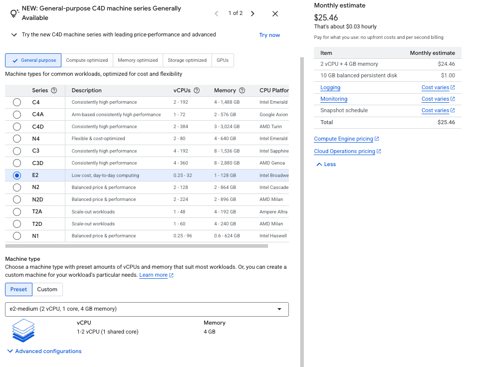
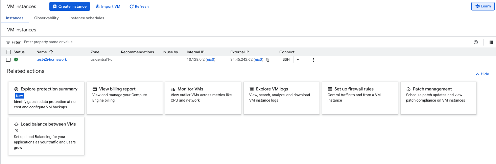
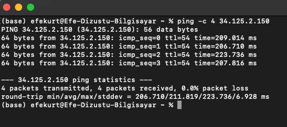

# 🌩️ Google Cloud VM Creation and Ping Test

## Introduction

Did you know that the first cloud datacenter was launched over a decade ago, yet millions of new virtual machines are still created daily worldwide? A Virtual Machine (VM) is like a computer inside a computer — running remotely but accessible from anywhere.  

In this project, we’ll set up a Google Cloud VM and test its connectivity with a simple ping. This small step unlocks the door to endless possibilities in cloud computing and infrastructure management.

---

## Purpose  
Create a VM on Google Cloud Platform and ping it from outside.

## Tools Used  
- Google Cloud Platform  
- Compute Engine  
- Terminal (macOS/Linux/Windows)

## Steps and Screenshots

### 1. Create GCP Account  
Sign up and log in to Google Cloud Platform. ([GCP site](https://cloud.google.com/))

### 2. Create a New Project  
Create a new project in the GCP console. (just click "Create Project", name it, and proceed.)

### 3. Enable Compute Engine  
Enable the Compute Engine API.

### 4. Configure VM  
  
Set up your VM with name, region, and machine type.

### 5. Note IP Address  
  
Copy the external IP of your VM.

### 6. Ping Test  
  
Ping the VM IP from your terminal to verify connectivity.

---

## Result  
VM created successfully and reachable via ping from outside.
