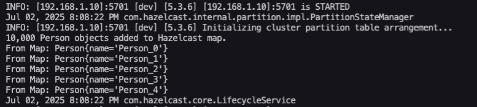

# Hazelcast EX-03 - Person Object Serialization Test

## Introduction

Imagine you're working on a distributed application and need lightning-fast in-memory storage that can scale. Hazelcast offers just that — but how do we verify it's working? In this exercise, we'll serialize a `Person` object into a distributed Hazelcast map, repeating this process 10,000 times to test both memory sharing and object serialization over the cluster.

---

## Purpose  
To practice inserting and retrieving 10,000 `Person` objects into Hazelcast distributed map using Java.

## Tools Used  
- Hazelcast 5.x Server  
- Java 21  
- Hazelcast Client Library  
- Terminal (macOS)

## Steps and Screenshot

### 1. Compile and Run Java Program  
This Java application puts 10,000 `Person` objects into the distributed map named `people` and prints confirmation when retrieving them.

  
Hazelcast successfully stores and retrieves the objects.

---

## Result  
The Hazelcast server accepted 10,000 entries and the Java client retrieved them successfully. This confirms a functional Hazelcast setup and working serialization.
