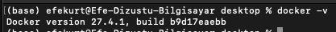
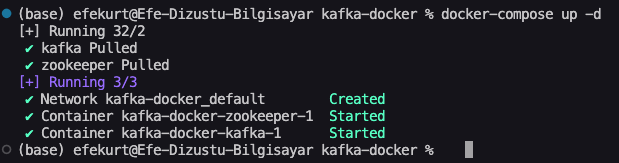
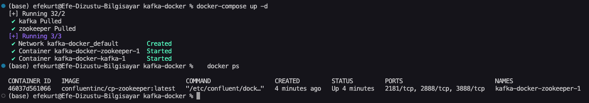

# Kafka Local Setup

This document shows how Apache Kafka was installed and run locally using Docker Compose.  
All steps are backed by screenshots to demonstrate successful setup.

---

## Tools Used  
- macOS Terminal  
- Docker  
- Docker Compose  

---

## Steps and Screenshots

### 1. Check Docker Installation  
Make sure Docker and Docker Compose are installed.

  
This confirms that Docker and Docker Compose are available on the local machine.

---

### 2. Write the docker-compose.yml File  
Define Kafka and Zookeeper services in a `docker-compose.yml` file.

  
This file is used to launch both Kafka and Zookeeper with one command.

---

### 3. Start Services with Docker Compose 
Run the following command to launch both services:

  
This command runs both Kafka and Zookeeper services together in the background.

---

### 4. Verify Running Containers  
Run the following command to check if Kafka and Zookeeper containers are running:

  
This confirms that both Kafka and Zookeeper services are active.

---

## Result
Kafka was successfully installed and is running locally using Docker Compose.  
This setup allows easy management and testing of Kafka services on a local machine.