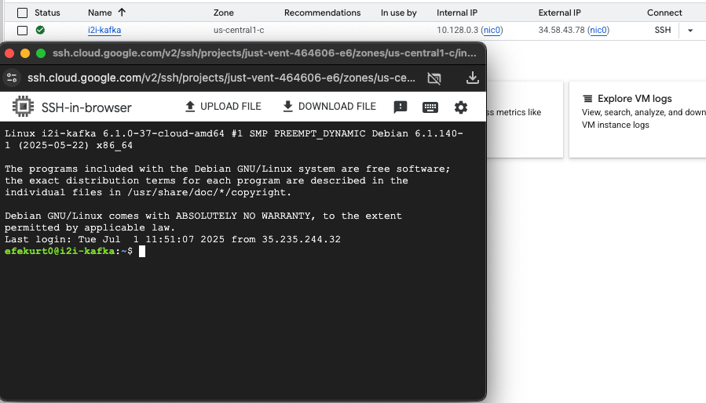
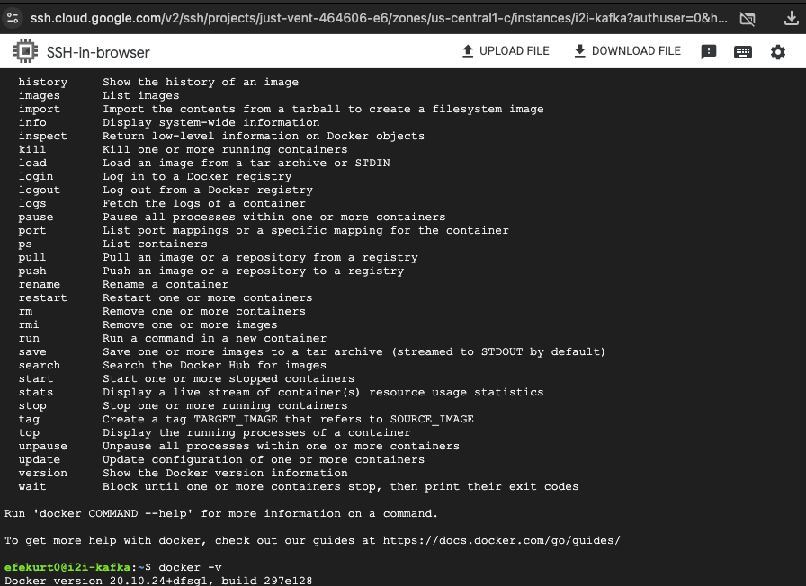
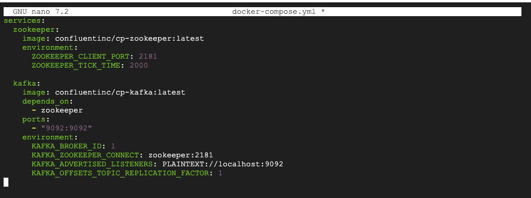
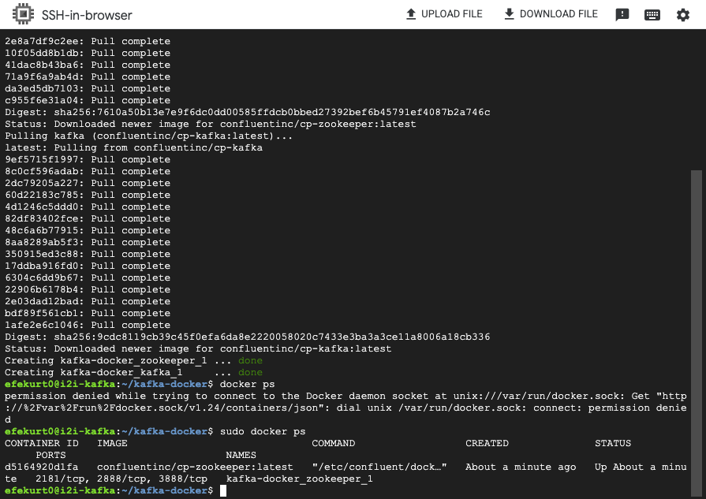

# Kafka Setup on GCP Virtual Machine

This document shows how Apache Kafka was installed and run on a Google Cloud Platform (GCP) Virtual Machine (VM) using Docker and Docker Compose.  
All steps are backed by screenshots.

---

## Tools Used  
- Google Cloud Platform (GCP)  
- Compute Engine VM  
- SSH Terminal  
- Docker  
- Docker Compose  

---

## Steps and Screenshots

### 1. Connect to the VM via SSH  
Access the GCP VM using SSH from terminal.

  
This screenshot shows the successful SSH connection to the VM.

---

### 2. Verify Docker Installation on the VM  
Check that Docker and Docker Compose are installed.

  
This confirms Docker and Docker Compose are installed on the VM.

---

### 3. Prepare the `docker-compose.yml` file on the VM  
The `docker-compose.yml` file defining Kafka and Zookeeper services is ready on the VM.

  
This shows the contents of the Docker Compose file on the VM.

---

### 4. Start Kafka and Verify Running Containers  
Run Docker Compose to start services and check running containers.

  
This screenshot confirms Kafka and Zookeeper containers are running on the VM.

---

## Result  
Kafka is successfully running on the GCP VM via Docker Compose, ready for development and testing.
