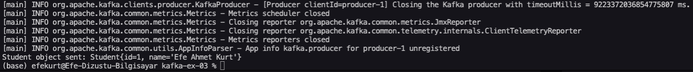
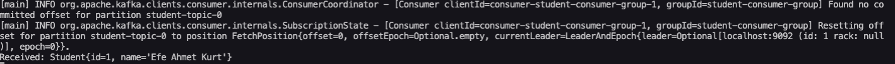

# Apache Kafka Java Producer & Consumer Test

## Introduction

Did you know Apache Kafka is used by 80% of Fortune 100 companies for high-throughput messaging systems? Kafka is a distributed streaming platform that can handle trillions of events a day.

In this project, we simulate a basic real-world data pipeline by using Java to send and receive a custom object (`Student`) via Kafka — showing how producers and consumers communicate through a topic.

---

## Purpose  
Send a Java object from a producer app to Kafka and read it from a consumer app.

## Tools Used  
- Java 17  
- Apache Kafka (via Docker Compose)  
- Terminal (macOS)  
- SLF4J (for logging)

## Steps and Screenshots

### 1. Run Producer App  
The `ProducerApp.java` sends a sample Student object (`Student{id=1, name='Efe Ahmet Kurt'}`) to Kafka topic `student-topic`.

---

### 2. Run Consumer App  
The `ConsumerApp.java` receives the Student object from Kafka and prints it to the terminal.

---

## Result  
Producer and Consumer Java applications successfully communicated via Kafka.  
The `Student` object was delivered through the topic and displayed on the console.
