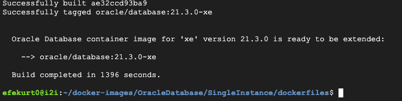
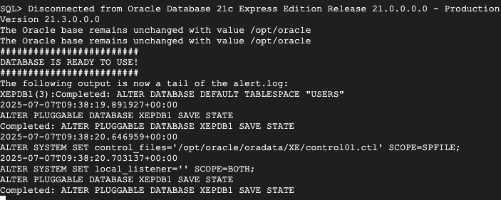
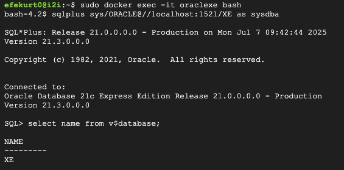

# Oracle XE Docker Setup (ORACLEDB-EX-02)

## Project Description

This project demonstrates how to pull, build, and run Oracle Database Express Edition (21c) inside a Docker container on a Google Cloud virtual machine (GCP VM). The task includes successfully accessing the database using SQLPlus and executing a basic query.

---

## Tools Used

- Google Cloud Platform (GCP)
- Docker
- Oracle XE 21.3.0 Docker Image
- SQLPlus

---

## Steps and Screenshots

### Oracle Docker Image Build  
Oracle XE 21.3.0 image is successfully built from source using the provided Dockerfiles.  

---

### Oracle Container Start  
Container was launched successfully and Oracle displayed the "DATABASE IS READY TO USE!" message.  

---

### SQLPlus Connection and Query  
Connected to Oracle Database using SQLPlus and executed the `select name from v$database;` query.  
The database responded with `XE`.  

---

## Result

Oracle Database XE container is up and running successfully on the GCP VM. SQLPlus connection was established, and a query was executed with the expected result.

