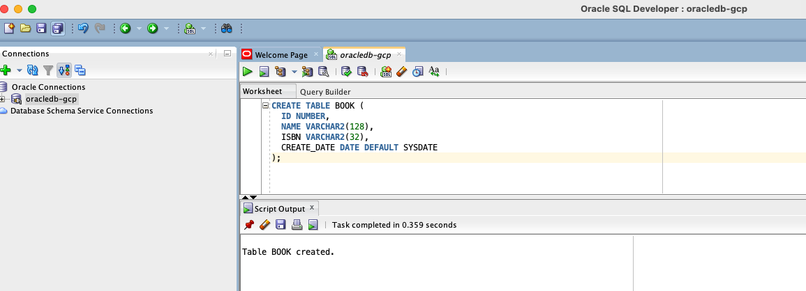

# ORACLEDB-EX-03 — BOOK Table Creation Completed

## Description

This document confirms the successful completion of the ORACLEDB-EX-03 assignment. The objective was to connect to a running Oracle XE instance using Oracle SQL Developer and create a table named `BOOK` with specified columns and defaults.

---

## Table Created

The following table was created inside the Oracle XE instance:

- **Table Name:** BOOK  
- **Columns:**
  - `ID` (NUMBER)
  - `NAME` (VARCHAR2(128))
  - `ISBN` (VARCHAR2(32))
  - `CREATE_DATE` (DATE DEFAULT SYSDATE)

---

## Screenshot

The screenshot below demonstrates the successful table creation:

---

## Result

- Oracle SQL Developer connected to GCP-hosted Oracle XE container  
- `BOOK` table created successfully via SQL worksheet  
- Output confirmed and captured in screenshot
