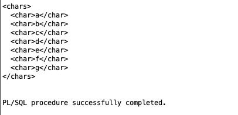

# PLSQL01-EX-08: XML Output from Input String

## Introduction

In this task, we focused on transforming a plain input string into a structured XML format using PL/SQL. The goal was to practice string functions, loops, and conditional logic in the Oracle SQL environment.

---

## Purpose  
Write a PL/SQL script that accepts an input string, checks for certain rules (max length, no repeating characters, no digits or spaces), and prints the valid string in XML format.

## Tools Used  
- Oracle SQL Developer  
- Oracle XE 18c (Docker)  

## Steps and Screenshot

### 1. Set Up Oracle XE Locally  
We used the Dockerized version of Oracle XE and connected to it via SQL Developer.

### 2. Write PL/SQL Logic  
The logic was written to check input validity and then display it in XML-style line-by-line output.

### 3. Enable DBMS Output and Run  
DBMS Output panel was enabled and the script was executed with a valid sample input string.

### 4. Output Screenshot  
Below is the final successful result obtained via `DBMS_OUTPUT` panel.

---

## Result  
The PL/SQL block worked correctly and produced a valid XML output string based on the given input. The result satisfied all rule conditions and completed without errors.
