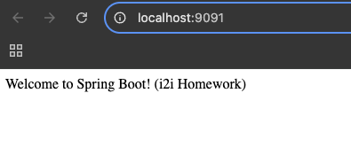

# SPRING-EX-04 – Spring Boot Starter Example

## Introduction

This simple Spring Boot application displays a welcome message using a REST API.  
Inspired by the [Baeldung Spring Boot Start Guide](https://www.baeldung.com/spring-boot-start),  
the goal is to practice building and running a minimal Spring Boot application from scratch.

---

## Purpose

- Understand basic Spring Boot project structure  
- Create a simple REST endpoint  
- Test the endpoint via browser  
- Prepare and push it as a GitHub-ready mini project

---

## Tools Used

- Java 17  
- Spring Boot  
- Spring Web  
- Maven  
---

## Steps and Screenshot

### 1. Create Project from start.spring.io  
- Added Spring Web as dependency  
- Group: `com.baeldung`, Artifact: `springbootstart`

### 2. Write the Controller
 Java class was created inside the main package that contains a method responding to HTTP GET requests on the root path (`"/"`).  
When the application runs, this endpoint returns a simple string message: **"Welcome to Spring Boot!"**

### 3.  Run the App
