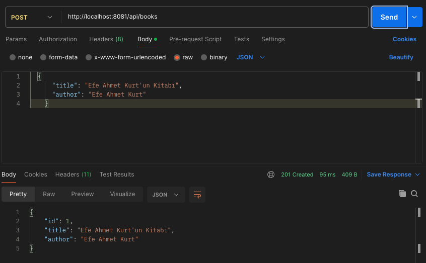
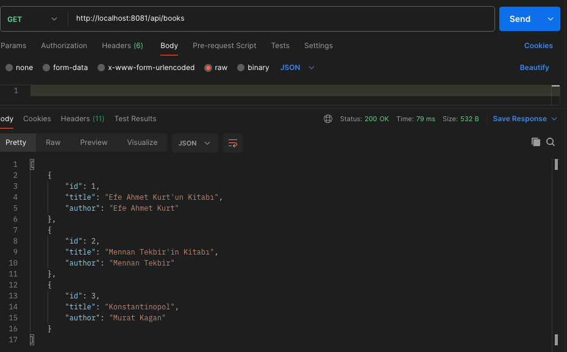
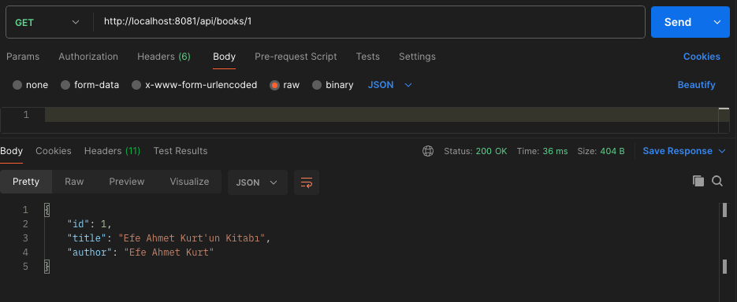
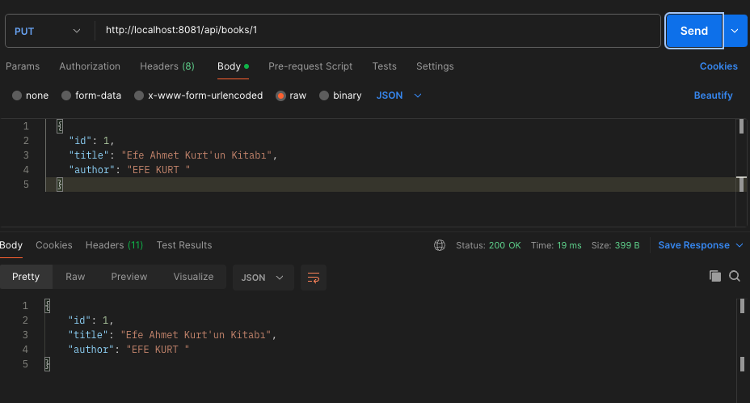
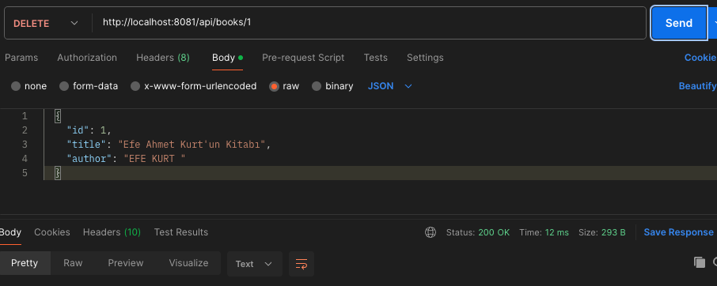

# Simple Book Application with Spring Boot

## Introduction

Spring Boot is a modern and powerful Java framework that allows you to quickly develop production-ready applications with minimal configuration.
In this project, I developed a Spring Boot application from scratch to perform book add, list, update, and delete (CRUD) operations.
I also added security and error handling to the application.
All steps and screenshots are provided below.

---

## Purpose
To develop a basic book management system with Spring Boot and to practice web, database, security, and error handling concepts hands-on.

## Tools Used
- Java 17
- Spring Boot
- H2 In-Memory Database
- Maven
- Postman (for API testing)
---

## Steps and Screenshots

### 1. Project Setup and Dependencies
All required dependencies were added to the `pom.xml` file.

---

### 2. Application Configuration
The `application.properties` file was configured for port and database settings.

---

### 3. Home Page and MVC Controller
A simple home page and controller were created.

---

### 4. Security Configuration
A security configuration was added to allow access to all endpoints.

---

### 5. Book Entity and Repository
The Book entity and repository interface were created.

---

### 6. BookController (CRUD API)
A controller was written to handle CRUD operations for books.

---

### 7. Error Handling and Exception Classes
Global error handling and custom exception classes were added.

---

### 8. API Tests (with Postman)
The following operations were tested with Postman:

#### a) Add Book (POST)

#### b) List All Books (GET)

#### c) Get Book by ID (GET)

#### d) Update Book (PUT)

#### e) Delete Book (DELETE)

---

## Result
The book management system was successfully developed and tested with Spring Boot.
All basic web, database, security, and error handling steps were implemented.