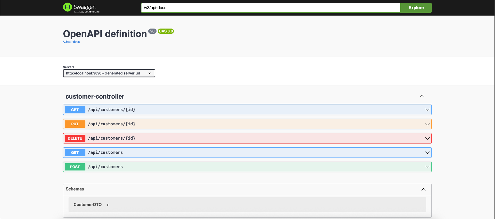

# SWAGGER-EX-04 – Spring Boot REST API with Swagger UI

## Introduction

Did you know that even without using a real database, you can build and document a fully functional REST API in Spring Boot?  
In this project, we created a layered CRUD application to manage customer data using in-memory storage, and documented it using **OpenAPI (Swagger UI)**.

---

## Purpose  
Create a simple Customer management REST API in Spring Boot with Swagger documentation.

## Tools Used  
- Java 17  
- Spring Boot  
- springdoc-openapi  
- Maven  
- Swagger UI  
- VS Code (IDE)  
- Terminal (macOS)

---

## Steps and Screenshot

### 1. Create DTO, Service, Controller Layers  
- `CustomerDTO`: holds ID, name, and email  
- `CustomerService`: performs in-memory CRUD logic  
- `CustomerController`: exposes REST endpoints with annotations  

### 2. Add Swagger UI  
- Added `springdoc-openapi-starter-webmvc-ui` dependency  
- No configuration needed, Swagger auto-generated

### 3. Run and Access Swagger UI  
- Application port changed to `9090`  
- Started with `./mvnw spring-boot:run`  
- Accessed from:  
  [http://localhost:9090/swagger-ui/index.html](http://localhost:9090/swagger-ui/index.html)

### 4. Screenshot  

---

## Result  
Swagger UI displays all 5 CRUD endpoints successfully.  
No database used – everything runs in-memory with a simple and clean API structure.
