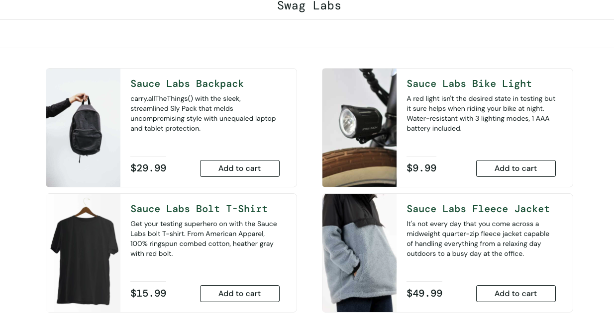

# Selenium Login Automation - TESTAUT-EX-01

Its purpose is to create a basic Selenium test that automates the login to a sample e-commerce website.

---

## Technologies Used
- Java
- Maven
- Selenium
- ChromeDriver
- VS Code

---

## What It Does

This automation:
- Opens [https://www.saucedemo.com](https://www.saucedemo.com)
- Enters the username and password
- Clicks the login button
- Verifies that login was successful by observing the inventory page

---

##  Screenshots

###  Terminal Execution
This screenshot shows the test running via Maven:

---

### Login Success Screen
After login, the user lands on the product list page:

---

## Result

Login automation runs successfully and closes the browser after login.