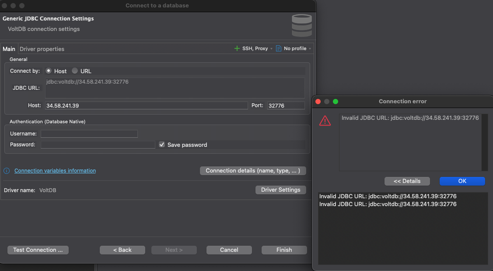
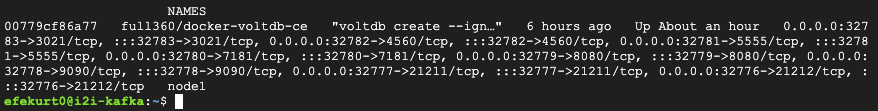

# VOLTDB-EX-03 Error Review

## Purpose

To connect to the VoltDB database using the DBeaver GUI and execute a test query.

---

## Tools Used

- DBeaver 
- VoltDB 

---

## Problem & Observations

### 1. JDBC Connection Error

As shown below, an attempt was made to connect through DBeaver:

📸 **DBeaver Settings and Error Message:**

DBeaver returned the following error:

This error indicates that the JDBC connection string was considered invalid, even though the format appeared correct. The root cause is explained below.

---

### 2. Docker Container Status

📸 **Running VoltDB Container Details:**

The Docker container shows that the following ports are exposed:

- 32776 → 21212 (VoltDB client connection port)
- 32777 → 21211 (admin panel)

Based on this, a successful connection should have been possible. However, it still failed.

---

## Cause of the Problem

- The `voltdbclient-x.x.x.jar` file was added to the project, but DBeaver was unable to load the `org.voltdb.jdbc.Driver` class.
- Even after manually selecting the class with “Find Class,” the class reference kept disappearing.
- Although the connection URL was written in the correct format `jdbc:voltdb://<host>:<port>`, DBeaver still marked it as invalid.
- This likely occurred due to either a faulty or incompatible `.jar` file or because DBeaver doesn't fully support VoltDB out of the box.

---

## Result

Even though the VoltDB container was running and accessible, a connection could not be established via DBeaver. The necessary `.jar` was added, but the class couldn't be loaded and the JDBC URL was rejected. Therefore, this step could not be completed.

