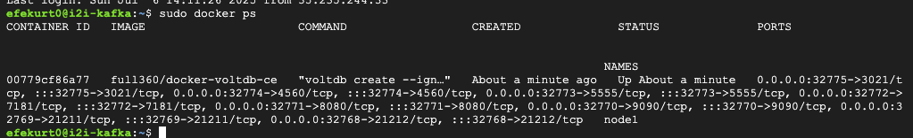
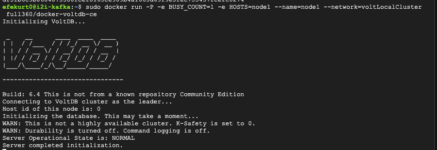
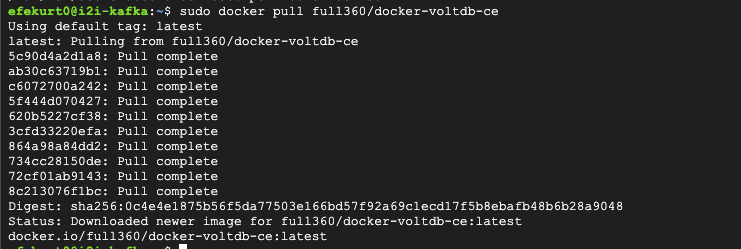

# VOLTDB-EX-02 – Running VoltDB Container on GCP

## Objective

In this task, a virtual machine (VM) on Google Cloud Platform (GCP) is used to pull and run the **VoltDB Community Edition** container using Docker. The following screenshots document the key steps of the process.

---

## Tools and Platforms Used

- Google Cloud Platform (Compute Engine)
- Docker
- VoltDB 

---

## Step-by-Step Process with Screenshots

###  Pulling the VoltDB Docker Image on GCP

The screenshot below shows the result of executing `sudo docker pull full360/docker-voltdb-ce` on the GCP VM, confirming that the VoltDB image has been successfully pulled from Docker Hub.

---

### 2. Running the VoltDB Container on GCP

This screenshot displays the logs after running the VoltDB container using the `sudo docker run` command on the GCP VM. It confirms that the container has started successfully.

---

### 3. Verifying the Running Container

Finally, the screenshot below shows the output of the `sudo docker ps` command, confirming that the container named `node1` is actively running on the GCP VM.

---

## Conclusion

The VoltDB Community Edition container has been successfully pulled and executed on a virtual machine hosted on Google Cloud Platform. The process was verified by checking the running container status using `docker ps`, and all relevant steps have been documented with screenshots.
