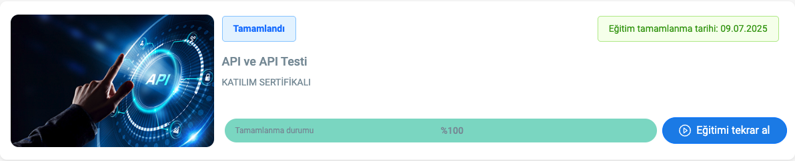

# API and API Testing - Course Summary

This document provides a concise summary of the **"API and API Testing"** course completed on the **BTK Academy** platform. The course introduces core concepts around building, understanding, and testing APIs in software development.

---

## Course Overview

The course covers the fundamentals of Application Programming Interfaces (APIs), the HTTP protocol, and best practices for API testing. It is designed for developers and testers seeking to understand how APIs function and how to validate their behavior effectively.

---

## Key Topics Covered

### Introduction to APIs

- What is an API: A set of rules that allows software applications to communicate with each other
- Types of APIs:
  - RESTful APIs
  - SOAP APIs
  - (Brief mention of GraphQL)
- Client-server architecture
- HTTP methods: GET, POST, PUT, DELETE
- HTTP status codes and their meanings

### API Development Basics

- Designing API endpoints
- Data formats: JSON and XML
- API documentation using Swagger (OpenAPI)
- Introduction to REST principles

### API Testing Fundamentals

- Types of API tests:
  - Functional Testing
  - Performance Testing
  - Security Testing
- Manual API testing with Postman
- Introduction to automation in API testing
- Creating mock APIs for testing purposes

---

## Skills Gained

- Understanding of how APIs operate within software systems
- Ability to design and document APIs
- Proficiency in using Postman for API testing
- Knowledge of HTTP protocols and request/response structures
- Exposure to RESTful service principles and test automation

---

## Tools and Technologies Used

- Postman – for API testing and automation
- Swagger (OpenAPI) – for API documentation
- Mock Servers – for simulating API responses
- JSON Formatter – for reading and validating JSON data

---

## Completion Evidence

Below is a screenshot confirming successful completion of the course:

> Replace the image path with your uploaded screenshot on GitHub.

---

## Notes

- This course is well-suited for beginners and intermediate learners in software development or quality assurance.
- It includes hands-on examples and exercises using widely adopted tools like Postman and Swagger.
- Practical knowledge gained through this course can be applied to real-world projects involving REST APIs and automated testing.

---

**Platform:** [BTK Academy](https://www.btkakademi.gov.tr)  
**Course Title:** API and API Testing  
**Level:** Beginner to Intermediate  
