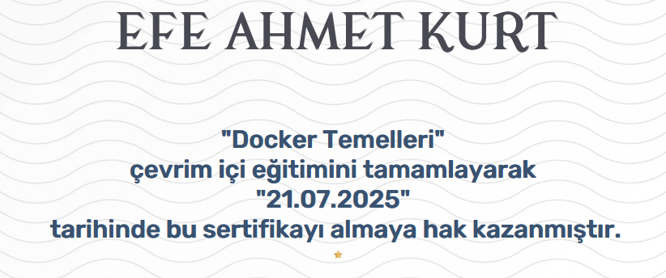

# Docker Fundamentals - Course Summary

This document provides a concise summary of the **"Docker'ın Temelleri"** course completed on the **BTK Academy** platform. The course introduces essential containerization concepts and practical usage of Docker in modern development and DevOps environments.

---

## Course Overview

The course aims to provide participants with foundational knowledge of containers, benefits of containerization, and the use of core Docker commands. It combines theoretical explanations with hands-on examples from real-world scenarios.

---

## Key Topics Covered

- What is Docker and how it differs from virtual machines  
- Basic Docker architecture and components (images, containers, volumes, networks)  
- Installing Docker and using the Docker CLI  
- Creating and managing containers and images  
- Writing simple Dockerfiles  
- Introduction to Docker Compose and Docker Swarm  
- Basic security considerations in containerized environments  

---

## Skills Gained

- Understanding of containerization principles  
- Ability to install, configure, and use Docker  
- Proficiency with core Docker commands  
- Experience with volumes, networking, and multi-container setups  
- Awareness of orchestration concepts with Docker Swarm  

---

## Tools and Technologies Used

- **Docker Engine & CLI**  
- **Docker Hub**  
- **Dockerfile**  
- **Docker Compose**  
- **Docker Swarm (Intro)**  

---

## Completion Evidence

Below is a screenshot confirming successful completion of the course:

---

## Notes

- This course is well-suited for beginners and IT professionals interested in containerization.  
- It offers a practical introduction to Docker with both theoretical and hands-on components.  
- A good foundation for further learning in DevOps, CI/CD, and Kubernetes.

---

**Platform:** [BTK Academy](https://www.btkakademi.gov.tr)  
**Course Title:** Docker'ın Temelleri  
**Level:** Beginner  
