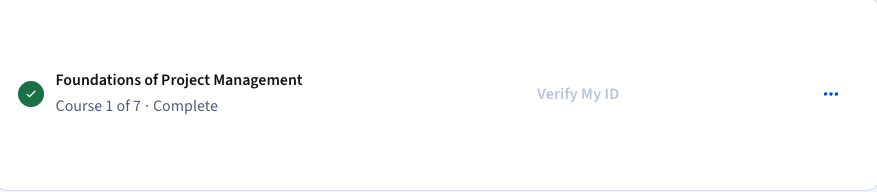

# Foundations of Project Management - Google Course

## Course Completed

This document serves as a summary and proof of completion for the **Foundations of Project Management** course provided by Google via Coursera.

---

## Course Overview

The **Foundations of Project Management** course introduces the core principles, responsibilities, and structures of professional project management. It is the first course in the **Google Project Management: Professional Certificate** program.

---

## Key Concepts Covered

- **Project Management Basics**
  - Definition of a project
  - The project life cycle
  - Project constraints (scope, time, cost)
  
- **Roles in Project Management**
  - Project manager responsibilities
  - Stakeholders and team dynamics

- **Project Management Methodologies**
  - Waterfall vs Agile
  - Scrum and Kanban overview
  - Projectized, Functional, and Matrix structures

- **Change Management**
  - Importance of clear communication
  - Resistance to change
  - Best practices for leading change initiatives

- **Organizational Culture**
  - How culture impacts project success
  - Learning culture through observation and communication

- **Project Governance**
  - Policies, procedures, roles, and accountability
  - Alignment with corporate governance

---

## Skills Gained

- Understanding of project management frameworks and tools  
- Knowledge of project roles and responsibilities  
- Introduction to Agile and Waterfall methodologies  
- Effective communication and stakeholder engagement  
- Awareness of organizational structure and its influence  

## Tools Mentioned

- Culture mapping  
- RACI chart  
- Project documentation (charter, proposal, plan)  
- Feedback mechanisms  
- Kanban boards

---

## Notes

This course is part of the **Google Project Management Certificate**, hosted on [Coursera](https://www.coursera.org/professional-certificates/google-project-management). It provides a solid foundation for aspiring project managers and team leads.

