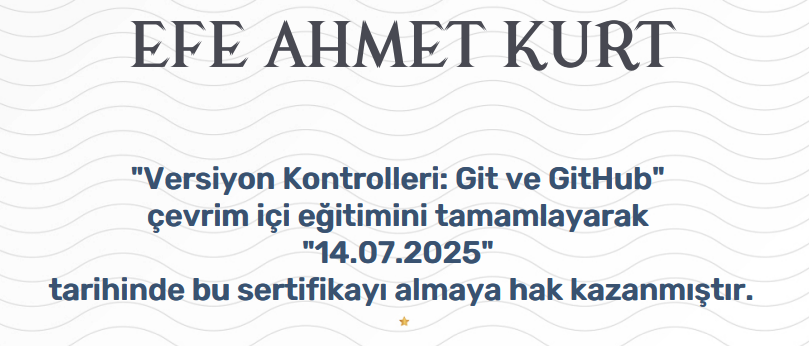

# Version Control with Git and GitHub - Course Summary

This document provides a concise summary of the **"Versiyon Kontrolleri: Git ve GitHub"** course completed on the **BTK Academy** platform. The course introduces core concepts of version control and teaches how to effectively use Git and GitHub in software development.

---

## Course Overview

The course is designed to teach developers and teams how to track, manage, and collaborate on code using Git and GitHub. It covers fundamental version control workflows and practical usage of Git commands in real-world projects.

---

## Key Topics Covered

### Introduction to Version Control

- What is version control and why is it important?
- Centralized vs Distributed version control systems
- Overview of Git and GitHub

### Git Basics

- Initializing a Git repository
- Staging and committing changes
- Understanding the Git workflow
- Viewing commit history and logs

### Branching and Merging

- Creating and switching branches
- Merging branches
- Conflict resolution
- Best practices for branching

### Working with GitHub

- Creating and cloning repositories on GitHub
- Pushing and pulling changes
- Creating and managing pull requests
- GitHub Issues and Collaboration tools

---

## Skills Gained

- Proficiency in using Git for version control
- Understanding of Git branching strategies
- Ability to collaborate on projects using GitHub
- Experience with resolving merge conflicts
- Familiarity with common Git commands and workflows

---

## Tools and Technologies Used

- **Git** – distributed version control system  
- **GitHub** – cloud-based collaboration and hosting platform  
- **Command Line Interface** – for executing Git commands  
- **VS Code / Text Editor** – for code and version management  

---

## Completion Evidence

Below is a screenshot confirming successful completion of the course:

> Make sure to replace the image path with your uploaded screenshot on GitHub.

---

## Notes

- This course is ideal for students, developers, and anyone involved in software projects.
- It provides strong foundational knowledge required for collaborating in professional development environments.
- Mastery of Git and GitHub is essential for modern DevOps and CI/CD practices.

---

**Platform:** [BTK Academy](https://www.btkakademi.gov.tr)  
**Course Title:** Versiyon Kontrolleri: Git ve GitHub  
**Level:** Beginner  
