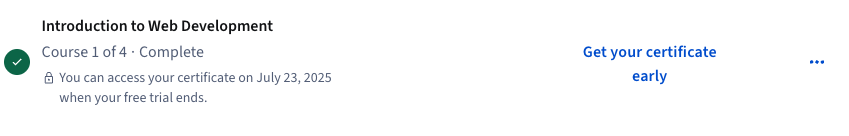

# Introduction to Web Development - Course Summary

This document provides a concise summary of the **"Introduction to Web Development"** course completed on the **Coursera** platform. The course offers a beginner-friendly introduction to core web development concepts, technologies, and tools.

---

## Course Overview

The course is designed to help absolute beginners understand how websites work and how web applications are built. It covers the foundational building blocks of the web: HTML, CSS, along with the roles of front-end and back-end development.

---

## Key Topics Covered

### Web Basics

- How the Internet and web browsers work
- Introduction to web servers and hosting
- The role of front-end and back-end in web development

### HTML (HyperText Markup Language)

- Structure of an HTML document
- Common tags: headings, paragraphs, lists, links, images
- Forms and input elements

### CSS (Cascading Style Sheets)

- Styling text and elements
- Box model, margin, padding, borders
- Layout techniques: Flexbox and Grid basics
- Applying colors, fonts, and themes

---

## Skills Gained

- Understanding of how websites are structured and displayed
- Ability to write and style HTML and CSS code
- Awareness of the full-stack development workflow

---

## Tools and Technologies Used

- **HTML** – for page structure and content  
- **CSS** – for styling and layout  
- **Web Browsers & Developer Tools** – for testing and debugging  

---

## Completion Evidence

Below is a screenshot confirming successful completion of the course:

> Make sure to replace the image path with your uploaded screenshot on GitHub.

---

## Notes

- This course is ideal for complete beginners with no prior programming experience.
- It builds a solid foundation for further learning in web design, front-end frameworks, and full-stack development.
- Real-world examples and mini-projects make it easy to understand how web technologies work together.

---

**Platform:** [Coursera](https://www.coursera.org)  
**Course Title:** Introduction to Web Development  
**Offered by:** University of California, Davis  
**Level:** Beginner  
