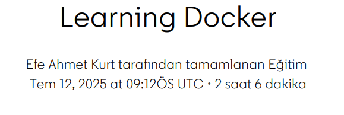

# Learning Docker Course Summary

This course introduces the core concepts and practical usage of Docker, a widely-used containerization platform in modern software development.  
It explains how Docker simplifies application deployment by packaging software and its dependencies into portable containers.

### Key topics include:
- Understanding containers vs virtual machines  
- Installing and configuring Docker  
- Docker CLI fundamentals: images, containers, volumes, networks  
- Writing and managing Dockerfiles  
- Building and running containerized applications  
- Using Docker Hub and custom registries  
- Basic troubleshooting and container lifecycle management

This course provides foundational knowledge to efficiently build, share, and deploy applications using Docker containers across different environments.

---

## Course Completion Screenshot

*The image above demonstrates the successful completion of the course.*
