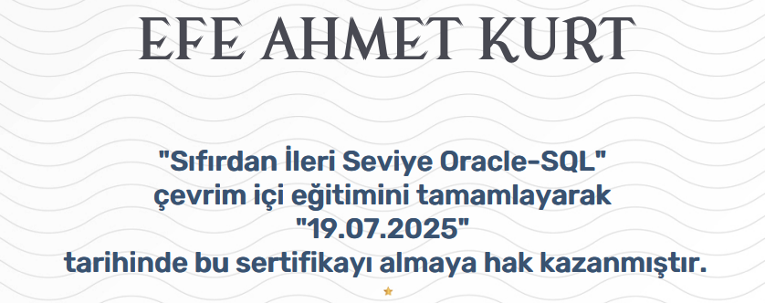

# Oracle SQL: From Beginner to Advanced - Course Summary

This document provides a concise summary of the **"Sıfırdan İleri Seviye Oracle SQL"** course completed on the **BTK Academy** platform. The course delivers comprehensive coverage of Oracle SQL, from foundational database queries to advanced techniques used in enterprise systems.

---

## Course Overview

The course is designed to take learners from the basics of SQL to advanced querying techniques specifically within the Oracle Database environment. It is ideal for those aiming to work with data professionally, especially in Oracle-based systems.

---

## Key Topics Covered

### SQL Basics

- Introduction to Oracle and relational databases  
- SELECT statements and filtering data with WHERE  
- Sorting results with ORDER BY  
- Using comparison, logical, and null operators  

### Intermediate SQL

- Working with built-in Oracle functions: string, numeric, date  
- GROUP BY and aggregate functions (COUNT, SUM, AVG, etc.)  
- HAVING clause and data grouping logic  
- Subqueries and nested queries  

### Advanced SQL Techniques

- JOIN operations: INNER, LEFT, RIGHT, FULL OUTER  
- Set operations: UNION, INTERSECT, MINUS  
- Creating and modifying tables (DDL)  
- Inserting, updating, and deleting data (DML)  
- Constraints: PRIMARY KEY, FOREIGN KEY, UNIQUE, CHECK  
- Views, synonyms, sequences, and indexes  

---

## Skills Gained

- Ability to write complex Oracle SQL queries  
- Proficiency in data retrieval, manipulation, and reporting  
- Understanding relational database design and integrity constraints  
- Hands-on experience with Oracle’s SQL syntax and functions  
- Familiarity with real-world enterprise SQL practices  

---

## Tools and Technologies Used

- **Oracle SQL** – primary language for data querying  
- **Oracle Database** – for executing and managing SQL scripts  
- **Oracle Live SQL / Local Instances** – for interactive exercises  
- **BTK Akademi Platform** – for structured course delivery  

---

## Completion Evidence

Below is a screenshot confirming successful completion of the course:

---

## Notes

- This course is highly recommended for anyone preparing for database roles or Oracle certification paths.  
- It builds a strong SQL foundation and prepares learners for more advanced topics such as PL/SQL and performance tuning.  
- The real-world examples and structured progression make it suitable for both students and professionals.

---

**Platform:** [BTK Academy](https://www.btkakademi.gov.tr)  
**Course Title:** Sıfırdan İleri Seviye Oracle SQL  
**Level:** Beginner to Advanced  
