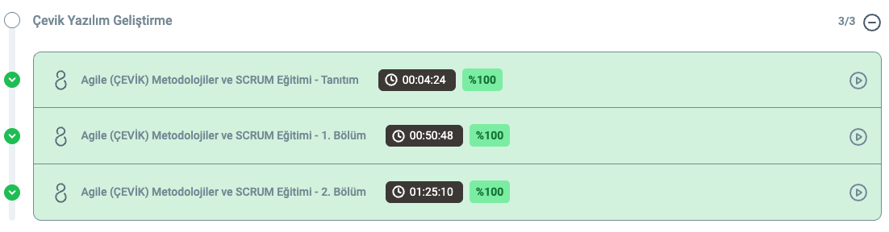

# Agile, Agile Methodologies and Scrum Course Summary

---

## English Summary

This course covers the fundamental concepts of Agile methodologies and the Scrum framework.  
It explains how Agile promotes flexibility, quick adaptation, and customer focus in software development. The course also details Scrum's key components such as roles, ceremonies, and artifacts.

### Key topics include:
- Agile Manifesto and principles  
- Scrum Roles: Product Owner, Scrum Master, Development Team  
- Scrum Ceremonies: Sprint Planning, Daily Scrum, Sprint Review, Sprint Retrospective  
- Sprint and Backlog management  
- Team communication and continuous improvement  

This knowledge aims to enable effective collaboration and rapid value delivery in projects using Agile methods.

---

## Course Completion Screenshot

*The image above demonstrates the successful completion of the course.*