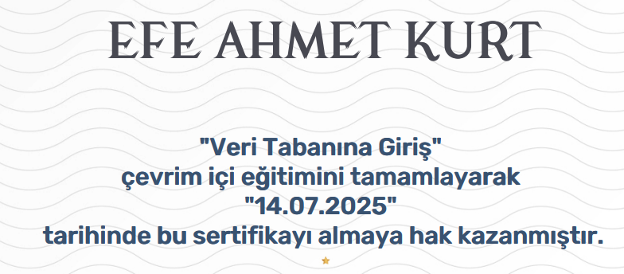

# Introduction to Databases - Course Summary

This document provides a concise summary of the **"Veri Tabanına Giriş"** course completed on the **BTK Academy** platform. The course introduces fundamental database concepts and explains how relational databases work, along with practical SQL basics.

---

## Course Overview

The course aims to provide foundational knowledge on how databases are structured, how data is stored and queried, and how SQL is used to interact with relational database systems. It is intended for beginners who want to understand how data is managed in software systems.

---

## Key Topics Covered

### Database Fundamentals

- What is a database?
- Difference between data and information
- Database vs Spreadsheet
- Advantages of using databases

### Relational Database Concepts

- Tables, Rows, and Columns
- Primary Key and Foreign Key
- Relationships (one-to-one, one-to-many, many-to-many)
- Data types and constraints

### SQL Basics

- Introduction to SQL (Structured Query Language)
- SELECT, INSERT, UPDATE, DELETE commands
- Filtering with WHERE clause
- Sorting with ORDER BY
- Joining multiple tables
- Aggregate functions: COUNT, SUM, AVG, etc.

---

## Skills Gained

- Understanding the structure and function of relational databases
- Ability to design simple data models with relationships
- Writing basic SQL queries to retrieve and manipulate data
- Familiarity with key database terminology and operations

---

## Tools and Technologies Used

- **SQL** – for querying and managing relational databases  
- **Relational Database Systems** – examples include MySQL, PostgreSQL  
- **BTK Akademi Practice Environment** – for hands-on exercises  

---

## Completion Evidence

Below is a screenshot confirming successful completion of the course:

---

## Notes

- This course is a strong starting point for anyone interested in backend development or data management.
- Concepts learned here are directly applicable to real-world systems using MySQL, PostgreSQL, Oracle, etc.
- Solid foundation for further learning in database design, optimization, and advanced SQL.

---

**Platform:** [BTK Academy](https://www.btkakademi.gov.tr)  
**Course Title:** Veri Tabanına Giriş  
**Level:** Beginner  
