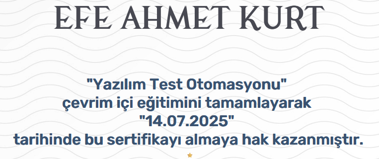

# Software Test Automation - Course Summary

This document provides a concise summary of the **"Yazılım Test Otomasyonu"** course completed on the **BTK Academy** platform. The course introduces the essential principles and tools used in automating software tests, with a focus on practical implementation and improving test efficiency.

---

## Course Overview

The course is designed to help software testers and developers understand how to automate the testing process using industry-standard tools and techniques. It covers both theoretical foundations and hands-on practices of test automation in modern software projects.

---

## Key Topics Covered

### Introduction to Test Automation

- What is test automation and why is it important?
- Differences between manual and automated testing
- Advantages and challenges of automation
- Testing pyramid and test levels (unit, integration, system)

### Test Automation Tools & Frameworks

- Introduction to Selenium WebDriver
- Locating elements on web pages (XPath, CSS selectors)
- Assertions and test validations
- Introduction to JUnit (for Java-based automation)
- Writing and executing automated test scripts

### Automation Strategies and Best Practices

- Test planning and strategy design
- Data-driven testing
- Page Object Model (POM) design pattern
- Running tests in browsers (Chrome, Firefox)
- Reporting and debugging test failures

---

## Skills Gained

- Ability to write and run automated tests using Selenium WebDriver
- Familiarity with test assertions and validations
- Understanding of test frameworks like JUnit
- Experience in identifying web elements and building test scripts
- Knowledge of automation architecture (POM, data-driven)

---

## Tools and Technologies Used

- **Selenium WebDriver** – for automating browser interactions  
- **JUnit** – for organizing and structuring test cases  
- **ChromeDriver / GeckoDriver** – for browser automation  
- **BTK Akademi Online Lab** – for hands-on practice  
- **Java** – as the programming language for automation  

---

## Completion Evidence

Below is a screenshot confirming successful completion of the course:

> Make sure to replace the image path with your uploaded screenshot on GitHub.

---

## Notes

- This course is ideal for QA engineers and developers aiming to automate repetitive and regression tests.
- It balances theory with hands-on labs to provide a practical understanding of real-world test automation.
- Skills gained in this course are applicable to modern software development pipelines including CI/CD systems.

---

**Platform:** [BTK Academy](https://www.btkakademi.gov.tr)  
**Course Title:** Yazılım Test Otomasyonu  
**Level:** Beginner to Intermediate  
